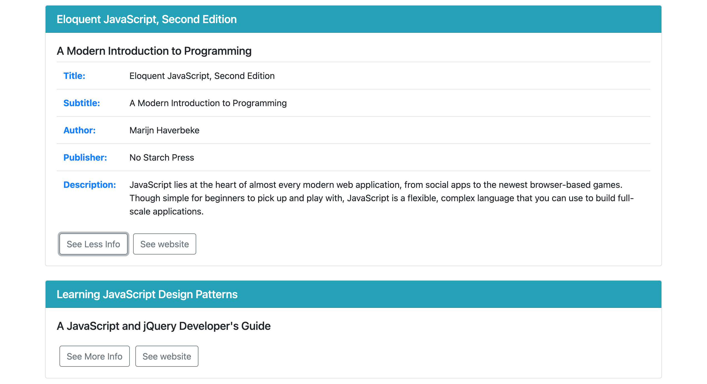

# Books Exercise

### Description

This program fetches json data containing a list of books and renders the list of books in a series of cards, each containing information about one of the books. The user can click the `See More Info` button on each of the cards to see more infomation about the book, including its author, publisher, and a description of the book. The user can also click the `See Website` button on each of the cards to be taken to a website containing more information about each book.

### How to Run

1. Download the zip file in github and navigate to the **Books-Exercise-main** directory in the terminal.
2. Run `http-server -c-1`.
3. When that is complete, load **localhost:8080** in the browser and click on the link for **index.html**. This will load the project in the browser.
4. Scroll through the book list and click on the buttons to interact with the program.

### Roadmap of Future Improvements

- **Search Bar** - I plan to create a search bar at the top of the program to allow users to seach a book among the list of books and then link to that section of the program. 
- **More Book Information** - I plan on adding more information to each of the book information tables including the date the book was published and how many pages each book is. 
- **Styling** - I plan to improve the styling such that each of the books has a picture associated with it and the picture appears in the heading of each card.

### License Information
Completed as an assignment for the [MIT Professional Certificate in Coding: Full Stack Development with MERN](https://executive-ed.xpro.mit.edu/professional-certificate-coding?utm_source=Google&utm_medium=c&utm_term=mit%20coding&utm_location=1027726&utm_campaign=B-365D_US_GG_SE_PCC_Brand&utm_content=MIT-Coding___School_Duration&gclid=Cj0KCQiAweaNBhDEARIsAJ5hwbe5iGViYiDsRYlBGKAHHLbH-GiiJ16dKOBbV7tvosiu9UTfbS7tAygaAkW1EALw_wcB).

See [MIT license](https://github.com/brandontanner/Books-Exercise/blob/main/LICENSE).
